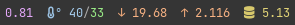

⚠️ **This repository has been deprecated. Use [crdx/panel](https://github.com/crdx/panel) instead.**

# panel

**panel** is an [xfce4-genmon](https://docs.xfce.org/panel-plugins/xfce4-genmon-plugin/start)-compatible tool for displaying system information. Its output is numeric statistics with icons. It is written in Crystal.

## Build

```bash
crystal build main.cr --no-debug --release -o panel
```

## Usage

Configure xfce4-genmon to run the binary at the desired interval. Every two seconds is recommended.

## Segments

Each segment is shown without a unit to save space, and they remain consistent so they can be memorised.

The values are shown at a consistent number of significant figures so that fluctuations in the values do not move the numbers on the panel around (as this is jarring).



### CPU Load

The 1-minute CPU load average value from `/proc/loadavg`.

**Unit**: load average to 3 sf and up to 1 dp.

### Temperature

The CPU and maybe GPU temperature.

The CPU temperature is read from a call to `sensors coretemp-isa-0000`, preferring the first value from [`Tdie`, `Package id 0`].

The GPU temperature is read from a call to `nvidia-smi` if the binary exists, otherwise not displayed.

Systems vary wildly so this segment may need some tweaking.

**Unit**: celcius to 2 sf and 0 dp.

### Network Up/Down

Network traffic from interfaces matching `^(enp|eno|wlp)` summed up from `/proc/net/dev`.

**Unit**: gigabytes to 4 sf and up to 3 dp.

### Memory Usage

Total system memory usage calculated from `/proc/meminfo` in the same way as `free` does it.

**Unit**: gigabyes to 3 sf and up to 2 dp.

## Contributions

Open an [issue](https://github.com/crdx/panel-cr/issues) or send a [pull request](https://github.com/crdx/panel-cr/pulls).

## Licence

[GPLv3](LICENCE).
